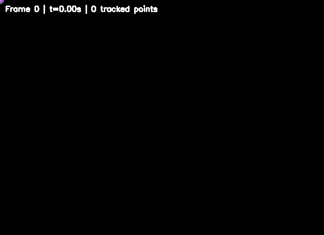
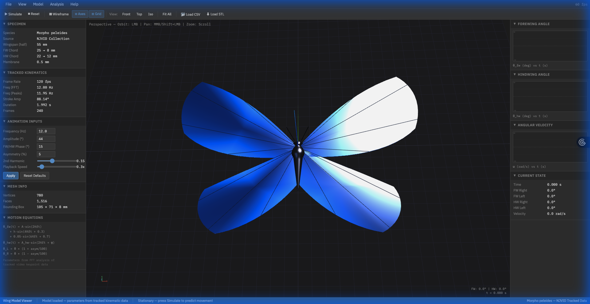
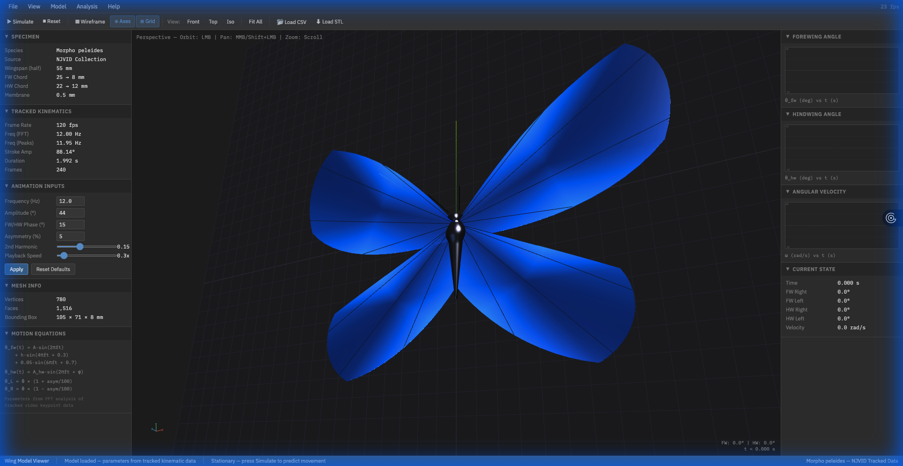
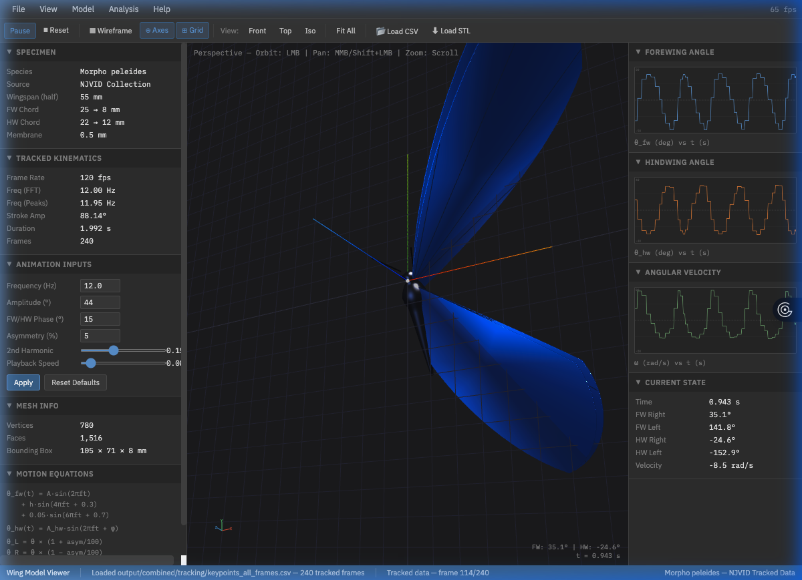

# Butterfly Flight Kinematics

This project analyzes the biomechanics of butterfly flight by extracting 3D wing motions from high-speed video data.

Aryan Putta

---

## Technical Overview

The system uses computer vision to track anatomical points on a butterfly's wings. This data is used to calculate flight metrics like wingbeat frequency and stroke amplitude, which then drive an interactive 3D model for study and visualization.

---

## Computer Vision Tracking

We use Lucas-Kanade optical flow to track 36 specific points on the butterfly. This includes 11 anatomical landmarks (like the head and wing tips) and 25 texture features. The tracker is designed to isolate the insect from the background, ensuring the data is strictly focused on the wing movement.



---

## Kinematic Analysis

The raw tracking data is converted into actionable metrics. We calculate the angle of each wing relative to the body and use a Fast Fourier Transform (FFT) to find the exact frequency of the wingbeats. This moves beyond simple sine waves to capture the real, asymmetrical rhythm of biological flight.


### PCA Motion Compression
By applying Principal Component Analysis (PCA), we can compress the complex motion of the wings into its most significant modes. This filters out noise and reveals the primary patterns of the flight stroke.


---

## Interactive 3D Viewer

The processed data is visualized in a browser-based 3D model. The model features anatomically accurate wing shapes and iridescent materials that mimic a Morpho peleides. It can either simulate flight based on calculated parameters or play back real tracked data frame-by-frame. The model also includes wing torsion (trailing-edge lag) and body heave/pitch responsive to the stroke cycle.

 


---

## Integrated Julia Notebook

A Pluto.jl notebook (`notebooks/integrated_flight_tracker.jl`) provides a single interface for running the full pipeline, viewing kinematic plots with FFT analysis, inspecting raw data tables, and exploring the 3D model — all in one tab.

---

## How to Run

### 1. Install Dependencies
```bash
pip install -r requirements.txt
```

### 2. Process Video
```bash
python run_pipeline.py data/raw/morpho_peleides.mp4 --live
```
The `--live` flag opens an OpenCV window showing the tracking in real time.

### 3. Open 3D Viewer
```bash
python3 -m http.server 8765
open http://localhost:8765/view_3d_model.html
```
The viewer auto-loads tracked data from `output/combined/tracking/keypoints_all_frames.csv` on startup. You can also click **Load CSV** to select a different file.

### 4. Julia Notebook (optional)
```bash
julia -e 'using Pluto; Pluto.run()'
```
Open `notebooks/integrated_flight_tracker.jl` from the Pluto interface.

---

## File Structure

- **Core Scripts**: `run_pipeline.py` (entry point), `multipoint_tracker.py` (CV logic).
- **Analysis**: `extract_kinematics.py` (math), `parametric_3d_model.py` (PCA).
- **Viewer**: `view_3d_model.html` (3D interface with data-driven animation).
- **Notebook**: `notebooks/integrated_flight_tracker.jl` (integrated Pluto dashboard).
- **Docs**: `docs/TRACKING_MATH.md` (detailed equations).
