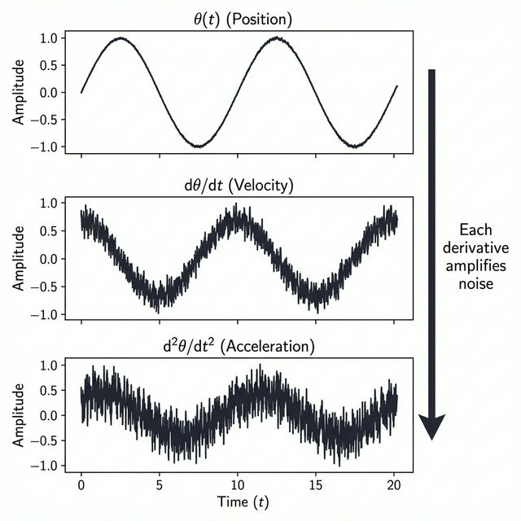
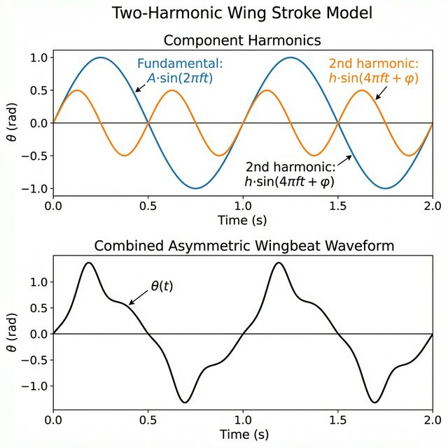

# Butterfly Flight Kinematics

Extracts wing kinematics from high-speed video of *Morpho peleides* and fits harmonic models for simulation.

Aryan Putta

---

## Pipeline Overview

| Stage | Method | Output |
|-------|--------|--------|
| Tracking | Lucas–Kanade optical flow, 36 points | per-frame (x, y) positions |
| Angle extraction | atan2 from thorax → wing tip | θ(t) time series |
| Harmonic fitting | Nonlinear least squares (LsqFit.jl) | A, f, h, φ parameters |
| Export | MATLAB / Julia / CSV / CFD header | simulation-ready θ(t) |

---

## Computer Vision Tracking

The tracker detects 11 anatomical landmarks and up to 25 Shi–Tomasi texture features, refined to subpixel accuracy. Tracking uses a 3-level image pyramid to handle large displacements. Every tracked point passes a forward–backward consistency check to catch drift.


---

## Wing Stroke Angle

The stroke angle θ(t) is computed from the thorax-to-tip vector for each wing, with a y-axis flip to convert from image to math coordinates:


---

## Noise Propagation

Each successive derivative amplifies tracking noise. This is why raw acceleration is essentially unusable without filtering:



Subpixel refinement (10× less pixel noise) and Savitzky–Golay filtering (3× additional reduction) combine for ~30× lower noise in acceleration.

---

## Harmonic Fitting

The wingbeat is modeled as a two-harmonic Fourier series. The second harmonic captures the asymmetry between the faster downstroke and slower upstroke:



Fitting uses `LsqFit.jl` with time normalization for numerical stability. A third harmonic can be added if residuals show structure at 3f. The fit produces 95% confidence intervals, R², and Durbin–Watson autocorrelation checks.

---

## Signal Conditioning

- **Savitzky–Golay** — preserves waveform shape, used for velocity/acceleration
- **Butterworth low-pass** — strict frequency cutoff, used before harmonic fitting
- **RANSAC** — rejects outlier points that violate the rigid-body wing model

---

## Kinematic Analysis


### PCA Motion Compression


---

## Interactive 3D Viewer

 


---

## How to Run

### 1. Install Dependencies
```bash
pip install -r requirements.txt
```

### 2. Process Video
```bash
python run_pipeline.py data/raw/morpho_peleides.mp4 --live
```

### 3. Harmonic Fitting (Julia)
```bash
cd notebooks
julia harmonic_fitting.jl --test                          # self-test
julia harmonic_fitting.jl ../output/kinematics.csv        # fit from data
julia harmonic_fitting.jl ../output/kinematics.csv --3harm # three harmonics
```

### 4. 3D Viewer
```bash
python3 -m http.server 8765
open http://localhost:8765/view_3d_model.html
```

### 5. Pluto Notebook (optional)
```bash
julia -e 'using Pluto; Pluto.run()'
```

---

## File Structure

- **Core**: `run_pipeline.py`, `multipoint_tracker.py`
- **Analysis**: `src/analysis.py` (SavGol, Butterworth, FFT, RANSAC, stroke angle)
- **Error Analysis**: `src/error_propagation.py`
- **Calibration**: `src/camera_calibration.py`
- **Export**: `src/simulation_export.py` (MATLAB, Julia, CSV, CFD)
- **Harmonic Fitting**: `notebooks/harmonic_fitting.jl`
- **Viewer**: `view_3d_model.html`
- **Notebook**: `notebooks/integrated_flight_tracker.jl`
- **Docs**: `docs/TRACKING_MATH.md`

---

## Assumptions

1. **2D projection** — single camera, no out-of-plane correction
2. **Rigid wing** — no torsion/camber deformation in the kinematic fit
3. **Constant frequency** — assumes steady-state wingbeat
4. **Symmetric stroke** — second harmonic captures some asymmetry; third adds more
